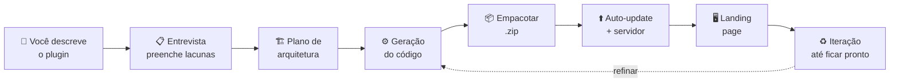
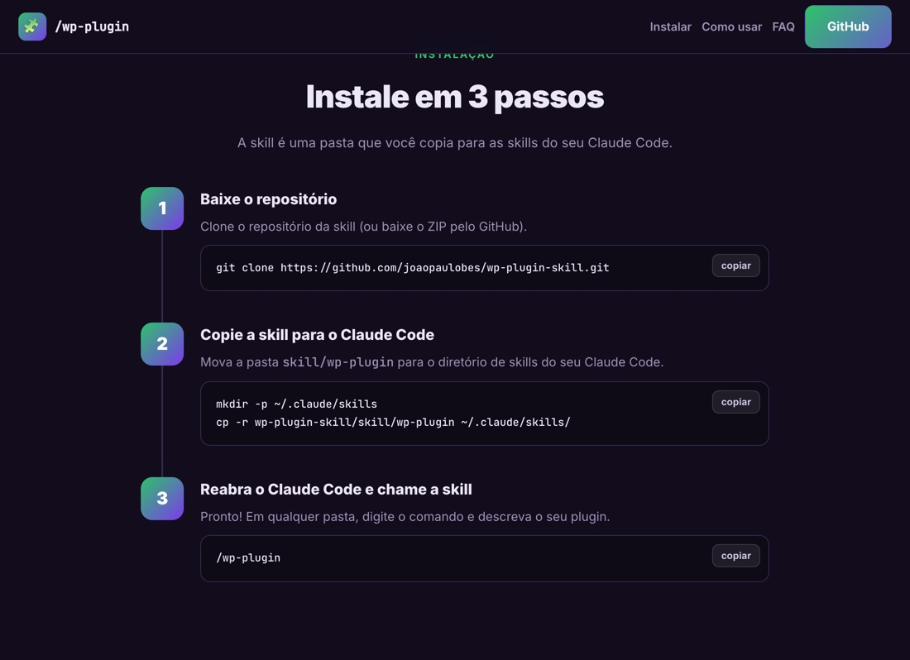
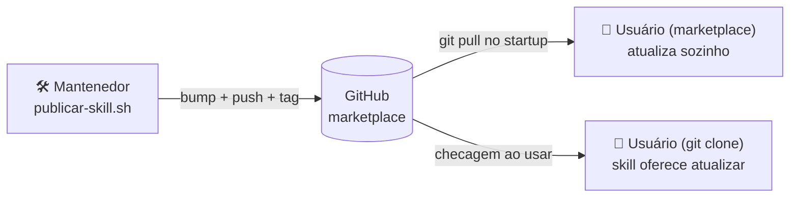
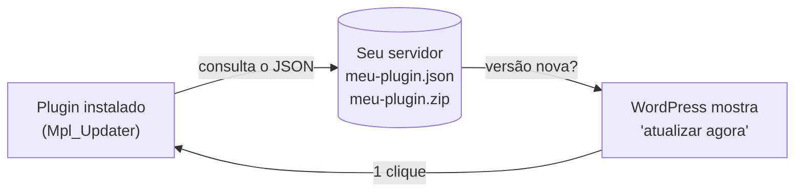

<div align="center">

<br>

# 🧩 `/wp-plugin`

### Construtor de Plugins de WordPress para o Claude Code

**Descreva o plugin que você quer — em português, do seu jeito — e receba o código completo, o `.zip` de instalação, o auto-update e a landing page. Prontos.**

<br>

[](https://github.com/joaopaulobes/wp-plugin-skill)
[](https://funnilab.com/skill-wpplugin)


[](https://github.com/joaopaulobes/wp-plugin-skill/stargazers)

<br>

[**🌐 Guia ilustrado**](https://funnilab.com/skill-wpplugin) · [**🚀 Instalação**](#-instalação) · [**💬 Como usar**](#-como-usar) · [**🧠 O que ela domina**](#-o-que-a-skill-domina) · [**❓ FAQ**](#-faq)

<br>

<a href="https://funnilab.com/skill-wpplugin"></a>

</div>

<br>

---

## 📑 Sumário

- [📖 Sobre](#-sobre)
- [🎯 O problema que resolve](#-o-problema-que-resolve)
- [✨ O que a skill entrega](#-o-que-a-skill-entrega)
- [⚙️ Como funciona (o pipeline)](#️-como-funciona-o-pipeline)
- [🧠 O que a skill domina](#-o-que-a-skill-domina)
- [🚀 Instalação](#-instalação)
- [🔄 Como a skill se atualiza](#-como-a-skill-se-atualiza)
- [💬 Como usar](#-como-usar)
- [📂 Estrutura do repositório](#-estrutura-do-repositório)
- [🔐 Segurança & qualidade](#-segurança--qualidade)
- [⬆️ Auto-update próprio](#️-auto-update-próprio)
- [🏷️ White-label](#️-white-label)
- [⚠️ Limitações (honestas)](#️-limitações-honestas)
- [🗺️ Roadmap](#️-roadmap)
- [❓ FAQ](#-faq)
- [🤝 Contribuindo](#-contribuindo)
- [📄 Licença](#-licença)

<br>

---

## 📖 Sobre

A **`/wp-plugin`** é uma *skill* (habilidade) para o **[Claude Code](https://www.anthropic.com/claude-code)**. Depois de instalada, você a invoca, **descreve em linguagem natural o plugin que quer** — pode comparar com plugins que já existem — e ela **constrói o plugin inteiro**: código no padrão WordPress, pacote `.zip` instalável, sistema de atualização automática e uma landing page profissional. Você vai refinando em conversa até ficar exatamente como imaginou, e instala no seu WordPress.

Por baixo, a skill carrega um **WordPress Plugin Blueprint** completo — o mapa de arquitetura de plugins (admin, front-end, banco de dados, REST, cron, blocos, segurança, distribuição) — e o combina com **templates prontos** e um **checklist de qualidade** para gerar plugins seguros, performáticos e profissionais.

> **Para quem é:** agências, infoprodutores, lojistas, desenvolvedores e qualquer pessoa que precise de um plugin sob medida — **sem precisar escrever PHP**.

<br>

## 🎯 O problema que resolve

Criar um plugin de WordPress decente envolve dezenas de decisões e armadilhas: estrutura de arquivos, hooks na ordem certa, `dbDelta` e migrações, nonces e capabilities, sanitização e escape, i18n, `readme.txt`, desinstalação limpa, empacotamento, atualização automática... Errar qualquer uma compromete segurança ou manutenção.

A `/wp-plugin` **encapsula toda essa expertise**. Você foca no *o quê* (a ideia); ela cuida do *como* (a engenharia), sempre seguindo as boas práticas oficiais do WordPress.

<table>
<tr>
<td width="50%" valign="top">

**❌ Sem a skill**
- Pesquisar APIs e hooks corretos
- Reaprender `dbDelta`, nonces, escaping
- Montar boilerplate do zero
- Esquecer i18n / `uninstall.php`
- Configurar auto-update na unha
- Horas/dias por plugin

</td>
<td width="50%" valign="top">

**✅ Com a `/wp-plugin`**
- Descreve a ideia em português
- Código seguro e no padrão, na hora
- Boilerplate + lógica reais (sem `TODO`)
- i18n, `readme`, `uninstall` inclusos
- Auto-update + guia de servidor prontos
- Minutos, com refino em conversa

</td>
</tr>
</table>

<br>

## ✨ O que a skill entrega

A partir da sua descrição, em uma sessão você recebe:

| Entregável | Detalhe |
|---|---|
| 🧩 **Plugin funcional** | Arquivo principal, classes, assets e lógica **realmente implementada** — seguro (nonce, capability, `$wpdb->prepare`, escaping) e com **i18n PT-BR**. |
| 📦 **Arquivo de instalação (`.zip`)** | Empacotado e validado (top-dir = slug, sem lixo). É só enviar em *Plugins → Adicionar plugin → Enviar plugin*. |
| 📄 **`readme.txt` + `uninstall.php`** | `readme.txt` no formato WordPress.org e desinstalação **opcional** (não apaga dados sem consentimento). |
| ⬆️ **Auto-update próprio** | Cliente embutido no plugin + JSON de metadados + **guia completo de configuração do servidor** + script `publicar.sh`. |
| 🖥️ **Landing page** | Página de vendas profissional (responsiva, dark-mode, favicon) + **página de instalação** passo a passo. |
| 🔍 **Modal "Ver detalhes" rico** | As telas/descrição/FAQ que aparecem no popup nativo de detalhes do plugin no painel. |
| ♻️ **Iteração** | Peça ajustes e a skill refaz código, versão, `.zip` e landing — quantas vezes quiser. |

<br>

## ⚙️ Como funciona (o pipeline)



1. **Entrevista** — a skill entende o escopo (o que faz, onde vive, dados, front-end, integrações, distribuição) e pergunta só o que for ambíguo.
2. **Plano** — escolhe os blocos do *blueprint* que se aplicam e define a estrutura de arquivos, o schema e os hooks.
3. **Geração** — escreve o plugin de verdade, seguindo o checklist de segurança e qualidade.
4. **Empacotamento** — gera e valida o `.zip` instalável.
5. **Auto-update** *(opcional)* — adiciona o cliente de update e entrega o guia do servidor + `publicar.sh`.
6. **Landing** — gera a página de vendas + a de instalação.
7. **Iteração** — você refina; ela versiona, re-empacota e re-publica.

<br>

## 🧠 O que a skill domina

A skill carrega o **WordPress Plugin Blueprint** (`skills/wp-plugin/references/blueprint.md`) — um mapa prático de **toda a anatomia** de um plugin. Cobertura:

<table>
<tr><th>Camada</th><th>Cobre</th></tr>
<tr><td><b>Bootstrap</b></td><td>Header, constantes, autoloader, ativação/desativação, <code>plugins_loaded</code>, <code>init</code></td></tr>
<tr><td><b>Banco de dados</b></td><td>Tabelas próprias (<code>dbDelta</code>) + <b>migrações versionadas</b>, Options, Transients, User/Post meta</td></tr>
<tr><td><b>Conteúdo</b></td><td>Custom Post Types, taxonomias, meta boxes</td></tr>
<tr><td><b>Admin</b></td><td>Menus, páginas, <b>Settings API</b>, <code>admin-post</code>, <b>AJAX</b>, ações em massa, assets</td></tr>
<tr><td><b>Front-end</b></td><td>Shortcodes, <b>blocos Gutenberg dinâmicos</b>, widgets, <b>rewrite/rotas</b> + <code>template_redirect</code></td></tr>
<tr><td><b>Integrações</b></td><td><b>REST API</b>, <b>WP-Cron</b>, <code>wp_mail</code>, chamadas a APIs externas (<code>wp_remote_*</code>) com cache</td></tr>
<tr><td><b>Segurança</b></td><td>Nonces, capabilities, queries preparadas, sanitização/escape, privacidade (LGPD)</td></tr>
<tr><td><b>i18n</b></td><td>Strings traduzíveis, <code>.pot/.po/.mo</code>, PT-BR</td></tr>
<tr><td><b>Distribuição</b></td><td><code>readme.txt</code>, <code>uninstall.php</code>, <b>white-label</b>, <b>auto-update</b>, landing, modal de detalhes</td></tr>
</table>

> Casos muito específicos (blocos com UI complexa no editor, integrações com plugins comerciais, etc.) podem precisar de ajuste manual — e a skill **avisa** quando for o caso.

<br>

## 🚀 Instalação

> 📖 **Guia visual passo a passo:** **[funnilab.com/skill-wpplugin](https://funnilab.com/skill-wpplugin)**

#### Requisitos

| Requisito | Para quê |
|---|---|
| **Claude Code** | Rodar a skill |
| **macOS ou Linux** | Ambiente |
| `zip` | Empacotar o `.zip` |
| `php` *(opcional)* | Lint local (`php -l`) |
| `curl` + `python3` *(opcional)* | Script de auto-update |
| Hospedagem estática *(opcional)* | Servir o auto-update |

### Método 1 — Marketplace (recomendado · auto-update) ⭐

Instala como **plugin** do Claude Code. O Claude Code **se atualiza sozinho no startup** sempre que você publica uma versão nova — sem fazer nada.

```bash
# no Claude Code:
/plugin marketplace add joaopaulobes/wp-plugin-skill
/plugin install wp-plugin@funnilab
```

Pronto. Depois é só usar (a skill se ativa quando você descreve um plugin, ou via o menu `/plugin`). Para forçar uma atualização manual: `/plugin marketplace update funnilab`.

<div align="center"><a href="https://funnilab.com/skill-wpplugin#instalar"></a></div>

### Método 2 — Cópia manual / git clone

Mantém o comando `/wp-plugin` limpo. A própria skill checa o GitHub quando é usada e oferece atualizar.

```bash
# 1) Clone este repositório
git clone https://github.com/joaopaulobes/wp-plugin-skill.git

# 2) Copie a pasta da skill para as skills do seu Claude Code
mkdir -p ~/.claude/skills
cp -r wp-plugin-skill/skills/wp-plugin ~/.claude/skills/

# 3) Reabra o Claude Code — a skill /wp-plugin está disponível
```

<details>
<summary><b>Atualizar (método 2)</b></summary>

A skill avisa quando há versão nova e atualiza com a sua permissão. Manualmente:
```bash
cd wp-plugin-skill && git pull && cp -r skills/wp-plugin ~/.claude/skills/
```
</details>

> 🔄 **Auto-update:** veja a seção [Como a skill se atualiza](#-como-a-skill-se-atualiza).

<br>

## 🔄 Como a skill se atualiza

Toda melhoria publicada no GitHub chega aos usuários por **dois canais complementares**:



- **Marketplace** — o Claude Code dá `git pull` do marketplace **no startup** e aplica a versão nova (avisa para `/reload-plugins`).
- **Checagem interna** — ao ser ativada, a skill compara a versão local com a do GitHub e **oferece atualizar** (ver `references/self-update.md`).

#### Publicando uma nova versão (mantenedor)

Um comando faz tudo (bump de versão + changelog + commit + push + tag + release):

```bash
./scripts/publicar-skill.sh                 # bump de patch
./scripts/publicar-skill.sh 1.2.0 "o que mudou"
```

O versionamento usa o campo `version` do `.claude-plugin/plugin.json` — o bump é o gatilho do auto-update.

<br>

## 💬 Como usar

No Claude Code, em qualquer pasta, digite:

```
/wp-plugin
```

A skill se apresenta e pede a descrição. **Descreva com o máximo de detalhe** — o que o plugin faz, onde aparece (painel/site), o que o usuário configura, integrações e, se ajudar, **compare com plugins que você conhece**. Quanto mais detalhe, melhor o resultado.

#### Exemplos de descrição

> 💡 *“Quero um plugin de aviso de cookies (LGPD) com texto e cores editáveis no painel e um botão de aceitar que lembra a escolha.”*

> 💡 *“Avaliações de produtos: um tipo de conteúdo para reviews, nota de 1 a 5, shortcode pra exibir numa página e a média no painel.”*

> 💡 *“Um encurtador de links com redirect, categorias e rastreio de cliques — parecido com o BetterLinks.”*

> 💡 *“Um formulário de orçamento que envia e-mail pro admin e guarda os pedidos numa tela do painel.”*

#### Exemplo de fluxo completo

<details>
<summary><b>Ver uma sessão típica do começo ao fim</b></summary>

```
você ›  /wp-plugin
skill ›  🧩 Me descreva o plugin que você quer criar…

você ›  Um aviso de cookies LGPD: barra fixa no rodapé com texto e cores
        configuráveis no painel, botão "Aceitar" que some a barra e lembra
        a escolha por 1 ano.

skill ›  📋 Entendi. Confirma o escopo?
         • Slug: aviso-cookies-lgpd · prefixo: Acl_
         • Painel: página de Configurações (texto, cor de fundo, cor do botão)
         • Front: barra fixa no rodapé via wp_footer + cookie de 1 ano (JS)
         • Sem tabelas (só options) · i18n PT-BR · uninstall opcional
         Quer auto-update e landing page?

você ›  Sim, os dois.

skill ›  🏗️ Plano + ⚙️ gerando…
         ✓ aviso-cookies-lgpd/ (plugin completo, seguro, i18n)
         ✓ aviso-cookies-lgpd.zip (instalável)
         ✓ auto-update (cliente + guia de servidor + publicar.sh)
         ✓ landing/ (página de vendas + instalação)
         Tudo pronto. Quer ajustar algo?

você ›  Deixa a barra com cantos arredondados e um X pra fechar.

skill ›  ✓ feito · versão 1.1.0 · zip re-empacotado.
```
</details>

<br>

## 📂 Estrutura do repositório

```
wp-plugin-skill/                 ← repo = plugin + marketplace do Claude Code
├── .claude-plugin/
│   ├── plugin.json               manifesto do plugin (versão → gatilho do auto-update)
│   └── marketplace.json          catálogo do marketplace "funnilab"
├── skills/wp-plugin/            ← a SKILL
│   ├── SKILL.md                  cérebro: entrevista → geração → iteração
│   ├── references/               conhecimento carregado sob demanda
│   │   ├── blueprint.md            mapa completo da arquitetura de plugins WP
│   │   ├── snippets.md             trechos prontos por padrão (CPT, REST, cron…)
│   │   ├── auto-update.md          servidor de updates do PLUGIN gerado
│   │   ├── landing.md              landing + screenshots + favicon + modal
│   │   ├── self-update.md          checagem de versão da PRÓPRIA skill
│   │   └── checklist.md            qualidade/segurança antes de entregar
│   └── templates/                esqueleto pronto (com placeholders)
│       ├── plugin/                 plugin-main, install, admin, updater, assets…
│       ├── publicar.sh             script de publicação do auto-update do plugin
│       └── landing/                template da landing page + favicon
├── scripts/publicar-skill.sh    ← publica nova versão da skill p/ todos
├── guia/                        ← página-guia (funnilab.com/skill-wpplugin)
├── docs/                        ← assets do README
├── .github/                     ← templates de issue + PR
└── README · LICENSE · CHANGELOG · CONTRIBUTING · SECURITY · CODE_OF_CONDUCT
```

<br>

## 🔐 Segurança & qualidade

Todo plugin gerado passa por um **checklist inegociável** (`references/checklist.md`). Garantias:

- 🛡️ **Nonces** em toda ação que muda estado (forms, AJAX, links de ação).
- 🔑 **Capabilities** (`current_user_can`) antes de qualquer ação sensível.
- 🧱 **Queries preparadas** (`$wpdb->prepare`) em 100% das consultas dinâmicas.
- 🧼 **Sanitização** na entrada + **escaping** na saída (`esc_html`/`esc_attr`/`esc_url`/`wp_kses`).
- 🌍 **i18n** desde o início + tradução PT-BR.
- 🧩 **Prefixação** total (funções, options, tabelas, hooks, handles) — sem colisões.
- 🗑️ **`uninstall.php`** que só remove dados se o usuário optar (default: preserva).
- 🔄 **Migração de schema** versionada via `dbDelta`.

> ⚖️ **Política de propriedade intelectual:** a skill **nunca copia código de plugins de terceiros**. Você pode comparar com plugins conhecidos para explicar o que quer, mas tudo é implementado **do zero** — funcionalidade e UX não são protegidas; código-fonte é.

<br>

## ⬆️ Auto-update próprio

O plugin pode avisar "atualização disponível" no painel e atualizar com **1 clique** — igual a qualquer plugin do diretório — a partir de um servidor que **você** controla.



A skill entrega o **cliente** (dentro do plugin), o **formato do JSON**, o **guia de configuração do servidor** e o script **`publicar.sh`** (build + upload atômico + validação). O guia inclui as armadilhas reais já resolvidas: *hotlink/CSP* nas imagens do modal, `open_file_cache` do nginx, cache de CDN e `pipefail`. Basta um servidor que sirva 2 arquivos estáticos.

<br>

## 🏷️ White-label

Plugins gerados já nascem rebrandáveis por filtros, sem editar o núcleo:

```php
add_filter( 'mpl_brand',           fn() => 'Minha Marca' );                       // nome exibido
add_filter( 'mpl_capability',      fn() => 'edit_posts' );                        // permissão de acesso
add_filter( 'mpl_update_json_url', fn() => 'https://meudominio.com/updates.json' ); // servidor de updates próprio
```

Ideal para **revender** o mesmo plugin com marcas diferentes para vários clientes.

<br>

## ⚠️ Limitações (honestas)

A skill cobre a **grande maioria** dos plugins. Itens que podem exigir ajuste manual (a skill sinaliza):

- **Blocos Gutenberg com UI rica no editor** (controles em React/JSX) — exigem build com `@wordpress/scripts`. Blocos **dinâmicos** (render em PHP) são cobertos nativamente.
- **Integrações profundas com plugins comerciais** (WooCommerce, Elementor, etc.).
- **Multisite avançado**, Customizer e fluxos muito específicos.

Nesses casos, a skill entrega a base sólida + aponta exatamente o que falta.

<br>

## 🗺️ Roadmap

- [ ] Captura automática de screenshots quando há um WordPress de teste disponível
- [ ] Geração de blocos Gutenberg com UI (scaffold `@wordpress/scripts`)
- [ ] Templates extras de auto-update (GitHub Releases, S3/R2)
- [ ] Suíte de testes (PHPUnit) opcional nos plugins gerados

> Sugestões? Abra uma [issue](https://github.com/joaopaulobes/wp-plugin-skill/issues).

<br>

## ❓ FAQ

<details>
<summary><b>Preciso saber programar?</b></summary>
Não. Você descreve o plugin em português e a skill escreve todo o código, no padrão e seguro.
</details>

<details>
<summary><b>Onde fica a pasta de skills do Claude Code?</b></summary>
Em <code>~/.claude/skills/</code>. Cada skill é uma subpasta com um <code>SKILL.md</code>. Copie a pasta <code>wp-plugin</code> para lá e reabra o Claude Code.
</details>

<details>
<summary><b>Funciona para qualquer tipo de plugin?</b></summary>
Para a grande maioria: telas no painel, front-end, shortcodes, CPTs, REST API, cron, blocos dinâmicos e auto-update. Casos muito específicos podem precisar de ajuste manual — a skill avisa.
</details>

<details>
<summary><b>A skill copia plugins que já existem?</b></summary>
Não. Você pode comparar com plugins conhecidos para explicar o que quer, mas ela implementa tudo do zero. Código de terceiros é protegido; funcionalidade e UX não são.
</details>

<details>
<summary><b>O auto-update é obrigatório?</b></summary>
Não, é opcional. Se quiser distribuir, a skill monta o cliente de update e entrega o guia completo de configuração do servidor (basta servir 2 arquivos estáticos).
</details>

<details>
<summary><b>Os plugins que eu criar são meus?</b></summary>
Sim. A skill é MIT e o que você gera com ela é seu — para usar, vender ou distribuir.
</details>

<details>
<summary><b>Preciso de chave de API / serviço pago?</b></summary>
A skill roda dentro do seu Claude Code. Os plugins gerados não dependem de serviços externos, a menos que você peça uma integração específica.
</details>

<br>

## 🤝 Contribuindo

Contribuições são muito bem-vindas! Abra uma [issue](https://github.com/joaopaulobes/wp-plugin-skill/issues/new/choose) para bugs/ideias ou um Pull Request para melhorias nos *references*, *templates* ou na página-guia.

| Documento | Para quê |
|---|---|
| [CONTRIBUTING.md](CONTRIBUTING.md) | Como contribuir, padrões e fluxo |
| [CODE_OF_CONDUCT.md](CODE_OF_CONDUCT.md) | Como nos tratamos por aqui |
| [SECURITY.md](SECURITY.md) | Reportar vulnerabilidades (privado) |
| [CHANGELOG.md](CHANGELOG.md) | Histórico de versões |

<br>

## 📄 Licença

Distribuído sob a licença **MIT** — veja [LICENSE](LICENSE). Os plugins que você gera com a skill são **seus**.

<br>

---

<div align="center">

Feito com 🧩 por **[FunniLab](https://funnilab.com)**

**[🌐 Guia](https://funnilab.com/skill-wpplugin)** · **[💻 GitHub](https://github.com/joaopaulobes/wp-plugin-skill)** · **[⭐ Deixe uma star](https://github.com/joaopaulobes/wp-plugin-skill/stargazers)**

<sub>Se este projeto te ajudou, considere deixar uma ⭐ — ajuda outras pessoas a encontrarem.</sub>

</div>
